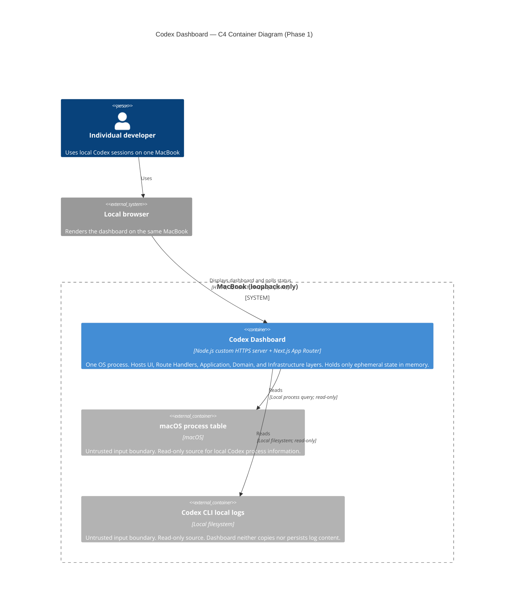

# アーキテクチャ基盤（ArchitectureBaseline）

| 項目 | 内容 |
|---|---|
| バージョン | 1.0 |
| 作成日 | 2026-08-25 |
| 技術スタック | TypeScript、Next.js App Router、React、Node.js、pnpm、Zod、Vitest、Playwright、Biome |
| SRE レビュー | 2026-08-25 — PASS（Critical 0件） |

## C4 Container 図



この図は Mermaid CLI 11.16.0 と Puppeteer 25.8.0 で SVG にレンダリング検証済みである。

`Codex Dashboard` は C4 Level 2 の単一 Container である。Route Handler、
Application、Domain、Infrastructure は、その単一 OS process 内のレイヤーであり、
別 Container ではない。

## レイヤー構成

採用パターンは、単一 process のモジュラーモノリス内に置くレイヤードアーキテクチャである。

| レイヤー | 責務 | 許可される依存先 | 禁止する依存 |
|---|---|---|---|
| Presentation | Browser 上の React UI を描画し、5秒周期で状態を表示する。色だけに依存しない状態表示とキーボード操作を提供する。 | Transport への同一 origin HTTPS リクエスト | Node.js の process・file API、Application、Domain、Infrastructure の直接 import |
| Transport | Next.js Route Handler で HTTPS リクエストを Application へ変換する。許可 origin は `https://127.0.0.1:3443` と `https://[::1]:3443` だけとし、他 origin の CORS 許可ヘッダーを出さない。 | Application の use case と transport DTO | Domain ルール、Infrastructure adapter、状態取得元への直接アクセス |
| Application | 状態収集を orchestration し、複数タブからの要求を同一収集周期へ coalesce する。1回の収集は4秒以内に完了させ、失敗時は旧状態を消去する。 | Domain の状態分類と、抽象化された状態取得境界 | Presentation、Node.js・ファイル・process API の直接利用、永続化 |
| Domain | `running`、`input-waiting`、`completed`、`unknown`、`acquisition_failed` の分類原則を保持する。状態分類の根拠は Epic Spec で確定する。 | 外側のレイヤーに依存しない | Presentation、Transport、Infrastructure、Next.js、Node.js |
| Infrastructure | macOS process table と Codex CLI local logs を read-only で読む。非信頼入力を Zod 等で構造検証し、分類に必要な最小フィールドだけを Application へ渡す。 | Application または Domain が定義する抽象化 | UI へのデータ直接送信、外部通信、ファイル書込み、永続キャッシュ、状態データのログ出力 |
| Runtime composition | ADR-001 に従い、2つの HTTPS listener と共通 Next.js request handler を1 OS processで構成する。 | Infrastructure と Application の起動境界 | `next dev` CLI、別 process の Next.js、TLS reverse proxy |

抽象化された状態取得境界の所有層は、業務用語と契約が未定のため Feature Design で決める。
所有層にかかわらず、Infrastructure はその抽象化を実装し、Presentation と Transport は
Infrastructure を直接 import しない。

## 依存方向ルール

```text
Browser Presentation
  → HTTPS Transport
  → Application
  → Domain

Infrastructure
  → Application または Domain が定義する抽象化
```

- 外側のレイヤーだけが内側へ依存する。
- Domain はフレームワーク・I/O・HTTP・ブラウザ API を参照しない。
- 非信頼入力である process table と local logs は Infrastructure で検証する。
- 生ログ、セッション本文、作業ディレクトリ、個別セッション識別子を UI、ログ、永続領域へ渡さない。
- `unknown` と `acquisition_failed` を `completed` へフォールバックしてはならない。
- `acquisition_failed` は通常の状態 payload に含めて返す。収集失敗自体は RFC 7807 ではない。
- リクエスト不正またはアプリ全体が処理不能な場合だけ、Transport は RFC 7807 の
  `application/problem+json` を返す。

## 実行時の起動・失敗規則

- ADR-001 の preflight が、証明書 SAN、期限、鍵対、macOS system trust store をすべて
  確認するまで listener と状態収集を開始しない。
- `127.0.0.1:3443` と `[::1]:3443` が両方 listen に成功した後にだけ状態収集を開始する。
- どちらか一方の bind または起動後の error が失敗した場合、起動済み listener を close し、
  状態収集を開始せず非0で終了する。
- HTTPS 起動成功後は、30秒以内に状態または状態取得失敗を画面へ表示する。
- 起動 preflight・TLS・port bind の失敗は UI を出さず、ターミナルの非0終了で扱う。
- 最大10セッションを対象に5秒周期で更新する。5分間・他負荷試験なしの条件で、
  アプリ CPU 平均利用率を5%以下に保つ。
- DB、キュー、永続キャッシュ、外部 API、外部テレメトリ、OpenTelemetry は追加しない。

## ロギング方針

OpenTelemetry は Charter で不採用である。観測は UI の `unknown` /
`acquisition_failed` 表示と、サーバー側の非機密なライフサイクル・エラーコードに限定する。

構造化ログには `requestId`、`path`、`durationMs`、安全なエラー分類だけを含める。
`userId` は常に `null` とし、状態、生ログ、セッション本文、作業ディレクトリ、
個別セッション識別子を出力しない。クライアントはログを出力しない。

## Analysis Notes

- `docs/PROJECT-CHARTER.md`、`aidd-framework/conventions/nextjs.md`、
  `docs/project-conventions/overrides.md`、ADR-001 を確認した。
- `docs/domain/bounded-contexts.md`、`docs/domain/aggregates/`、
  `docs/business-context/` は存在しない。状態分類の実証根拠と状態取得境界の契約は、
  Epic Spec と Feature Design で追加する。
- `docs/architecture/adr/` に既存 ADR はなく、ADR-001 が最初の ADR である。
- SRE 再レビューは2026-08-25に PASS した。非信頼入力境界、許可 origin、
  RFC 7807 境界、非機密ログ方針の提案を反映済みである。
- C4 Mermaid は固定版 Mermaid CLI 11.16.0 と Puppeteer 25.8.0 で SVG に
  レンダリング検証した。検証用生成物はリポジトリへ保存していない。
- 複数 listener の Next.js HMR は公式保証外である。ADR-001 に従い、HMR が使えない
  listener では手動リロードを許容する。

## 参照 ADR

- [ADR-001: Phase 1 のローカル HTTPS とデュアル loopback 実行方式](adr/ADR-001-local-https-dual-loopback-runtime.md)
- ADR-018、ADR-019: このリポジトリには存在しない。
